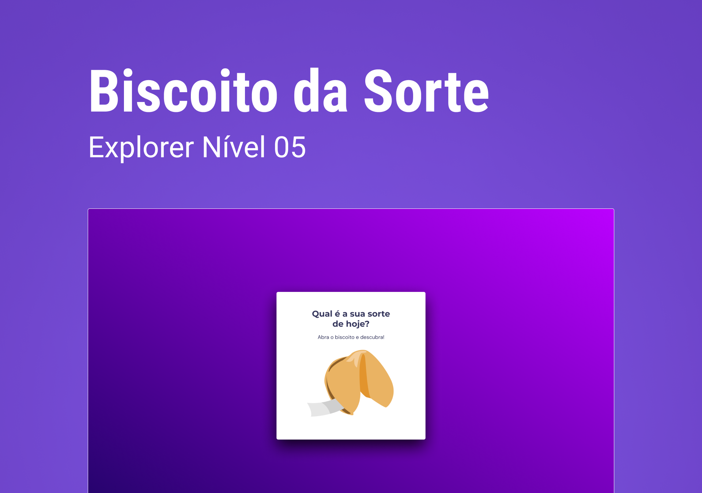

<h1 align="center"> stage 05 Desafio 02   Biscoito da Sorte </h1>

  <a href="#-tecnologias">Tecnologias</a>&nbsp;&nbsp;&nbsp;|&nbsp;&nbsp;&nbsp;
  <a href="#-projeto">Projeto</a>&nbsp;&nbsp;&nbsp;|&nbsp;&nbsp;&nbsp;
  <a href="#-layout">Layout</a>&nbsp;&nbsp;&nbsp;|&nbsp;&nbsp;&nbsp;
  <a href="#memo-licença">Licença</a>

  

 
  

   

## 🚀 Tecnologias

Esse projeto foi desenvolvido com as seguintes tecnologias:

- HTML 
- CSS
- Github
- Figma
- JavaScript

## 💻 Projeto

  Esse projeto foi desenvolvido utilizando HTML, CSS e JavaScript, e consiste em um programa interativo em que os usuários podem clicar ou pressionar "Enter" para abrir um biscoito virtual e descobrir a sua sorte do dia.

<h2> Conceitos usados na aplicação</h2>

  <ul>
  <li>Estrutura de dados HTML</li>
  <li>Animações com CSS</li>
  <li>Variáveis</li>
  <li>Funções no JavaScript</li>
  <li>biblioteca JS Math</li>
  <li>Manipulaçao da DOM</li>

  </ul>
      
 

- [Visite o projeto online](https://iaraMarques.github.io/Biscoito-Da-Sorte)

 

## 🔖 Layout

Você pode visualizar o layout do projeto através [DESSE LINK](https://www.figma.com/community/file/1182751789348533739). É necessário ter conta no [Figma](https://figma.com) para acessá-lo. 

  

## :memo: Licença

Esse projeto está sob a licença MIT.

---

Feito com ♥ by Iara Marques :wave: [Participe da comunidade da RocketSeat!](https://discord.gg/rocketseat)
